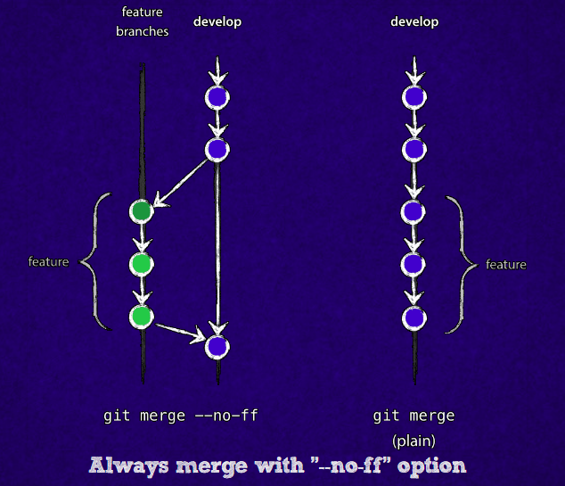
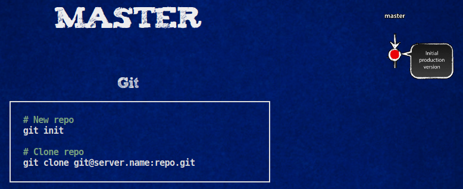
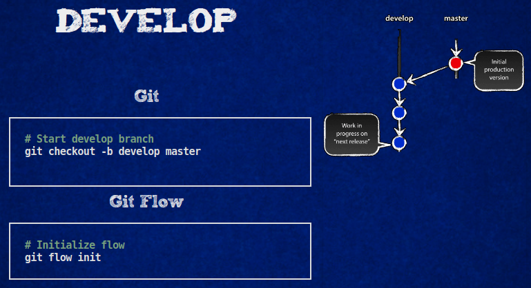
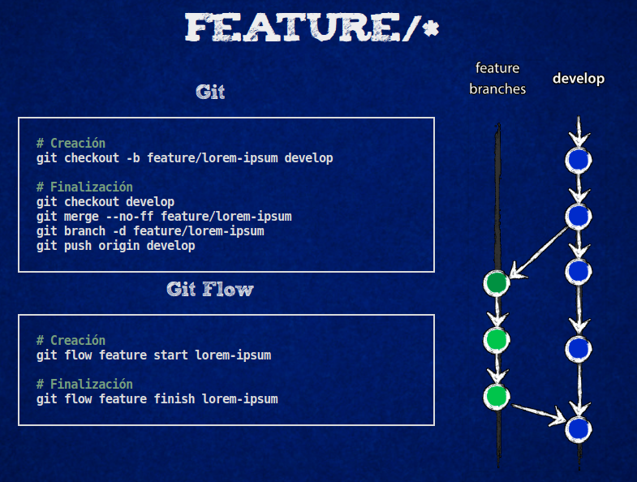
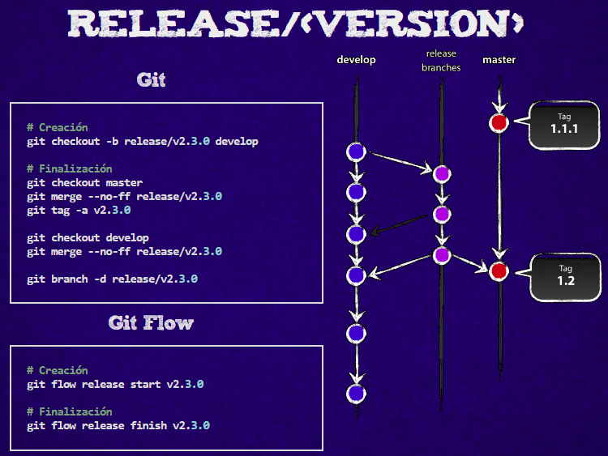
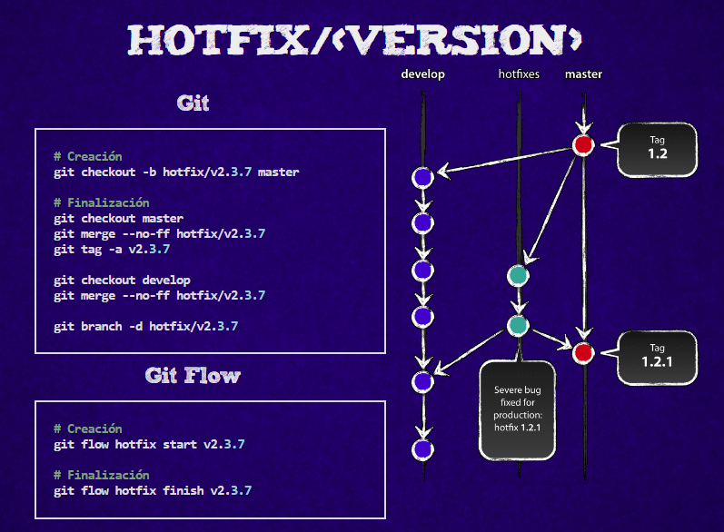

# Tutorial y uso de Git y Git Flow

[Git-Flow](http://aprendegit.com/que-es-git-flow/) es un conjunto de extensiones para [Git](https://git-scm.com/) que proveen comandos de alto nivel para operar repositorios basados en el [modelo de ramificaciones de Vincent Driessen](http://nvie.com/posts/a-successful-git-branching-model/).

Si queremos implementar este flujo de trabajo, cada vez que queramos hacer algo en el código, tendremos que crear la rama que corresponda, trabajar en el código, incorporar el código donde corresponda y cerrar la rama. A lo largo de nuestra jornada de trabajo necesitaremos ejecutar varias veces al día los comandos git, merge, push y pull así como hacer checkouts de diferentes ramas, borrarlas, etc. Git-flow son un conjunto de extensiones que nos ahorran bastante trabajo a la hora de ejecutar todos estos comandos, simplificando la gestión de las ramas de nuestro repositorio.

Las "reglas" que Vincent plantea en su blog son un ejemplo de cómo git nos permite implementar un flujo de trabajo para nuestro equipo. Estas no son reglas absolutas, bien es cierto que pueden funcionar en un gran número de proyectos, aunque no siempre será así. Por ejemplo ¿qué pasa si tenemos que mantener dos o tres versiones diferentes de una misma aplicación? Digamos que tenemos que mantener la versión 1.x, la 2.x y la 3.x. El tablero de juego es diferente así que necesitaremos ampliar y adaptar estas reglas para poder seguir jugando.

Git es una herramienta que nos permite modificar estas reglas y, lo que es más importante, cambiando y adaptándolas a medida que el proyecto avanza y el equipo madura. Una vez más, una buena dosis de sentido común será nuestra mejor aliada para responder las preguntas que nos surjan durante el camino.

## Instalación y Configuración

Un pre-requisito es una instalación de Git en funcionamiento. Git Flow funciona en OSX, Linux y Windows.

El cliente gráfico para OSX y Windows [Sourcetree](https://www.sourcetreeapp.com/) es una excelente GUI para git y tiene soporte para git-flow nativo. [GitKraken](https://www.gitkraken.com/) es una opción para los que quieren trabajar con Git Flow y un cliente gráfico que también soporte Linux.

### OSX - Homebrew

```shell
brew install git-flow-avh
```

### OSX - Macports

```shell
port install git-flow-avh
```

### Linux

```shell
apt-get install git-flow
```

### Windows (Cygwin)

```shell
$ wget -q -O - --no-check-certificate
 https://raw.github.com/petervanderdoes/gitflow-avh/develop/contrib/gitflow-installer.sh
 install stable | bash
```

## Introducción

Git-flow parte de la idea de un repositorio central remoto (que por defecto es origin). Se puede trabajar localmente con esta idea también pero la potencia la va a dar trabajar con un repo remoto.

Git-flow funciona basándose en **merges** o _fusiones de ramas_. No reorganiza (branch rebase) las **features branches** o _ramas de características_.

Git Flow, la mayoría de las veces que hace merges a **master** o **develop**, lo hace con la opción `--no-ff` _no fast-forward_ para asegurar que Git no haga la construcción de un _avance rápido_ sino que mantenga la de una _fusión_, así se mantiene una topología de bifurcación, como lo muestra la figura de abajo. Y digo, "la mayoría", porque como bien lo explica el autor en el [issue 100](https://github.com/nvie/gitflow/issues/100) del repositorio de GitFlow:

> Por diseño, git-flow usa la opción `--no-ff` cuando se fusiona para registrar que los commits pertenecen juntos históricamente. Sin embargo, cuando la rama de `features` contiene solo un commit, la confirmación de fusión adicional no agrega nada y solo complica innecesariamente el árbol de las ramas. Por lo tanto, para las ramas con un solo commit, las fusiones de avance rápido se realizan como si la confirmación se hubiera realizado en `develop` directamente. - Vincent Driessen

Un **_avance rápido_** es cuando, en lugar de construir un commit de fusión, git simplemente mueve su puntero de la rama para apuntar a la confirmación entrante. Esto ocurre comúnmente al hacer un _git pull_ sin ningún cambio local.



## Ramas Principales (main branches)

El trabajo se organiza en dos ramas principales:

* Master
* Develop

### Rama Master (master branch)

Cualquier commit que pongamos en esta rama debe estar preparado para subir a producción. Es la rama donde iniciamos nuestro proyecto y desde donde se clonará siempre nuestro proyecto. _**No se hacen commit aquí**_ (salvo raras excepciones de correcciones muy tontas)



### Rama Develop (develop branch)

Rama en la que está el código que conformará la siguiente versión planificada del proyecto. **_No se suelen hacer commits aquí_. Solo merges.**



## Ramas de Soporte

* Feature
* Realese
* Hotfix

### Rama de Características (feature branch)

Estas ramas se utilizan para desarrollar nuevas características de la aplicación que, una vez terminadas, se incorporan a la rama develop. **Es donde trabajaremos en el día a día y donde haremos nuestro commits.**

* Se originan a partir de la rama Develop.
* Se incorporan siempre a la rama Develop.
* Nombre: cualquiera que no sea master, develop, hotfix-* o release-*



### Rama de Versión (realese branch)

Estas ramas se utilizan para preparar el siguiente código en producción. En estas ramas se hacen los últimos ajustes y se corrigen los últimos bugs antes de pasar el código a producción incorporándolo a la rama Master. Esta rama "congela" la rama Develop. Parte de ella, a diferencia de Hotfix que, como veremos, parte de Master ("congela" a master como se dice habitualmente)

En la rama de versionado, se pueden hacer cambios menores referentes a configuraciones de la release como ser: archivos de configuraciones, archivos de librerías de la versión, correcciones muy menores para salir a producción, pero solo eso. No hay desarrollo de características aquí ni correcciones de bugs.

* Se originan a partir de la rama Develop
* Se incorporan a Master y Develop.
* Cuando se incorpora a Master se hace un tag con un versionado semántico (tres cifras: mayor-version.menor-version.patch-version)
* Nombre: release-*



### Rama de Corrección de Errores (hotfix branch)

Esas ramas se utilizan para corregir errores y bugs en el código en producción. Funcionan de forma parecida a las Releases Branches, siendo la principal diferencia que los hotfixes no se planifican. Parten de Master. Los cambios que se hagan aquí irán a producción.

* Se origina a partir de la rama Master
* Se incorporan a la Master y Develop
* Nombre: hotfix-*



Las ramas de Realese y Hotfix son las únicas permitidas para incorporar cambios (commits) a la rama master. Para decirlo de otro modo: **Master solo puede recibir merges de Realise y/o Hotfix**

Mientras que **las Features siempre irán a Develop.**

## Tools en acción

<https://github.com/nvie/gitflow>

## Referencias

* <http://aprendegit.com/que-es-git-flow/>
* <http://nvie.com/posts/a-successful-git-branching-model/>
* <https://danielkummer.github.io/git-flow-cheatsheet/index.es_ES.html>
* <http://slides.oxkhar.com/gitflow/#/4/1>
* <https://www.youtube.com/watch?v=b7tp-gx9gIs>
